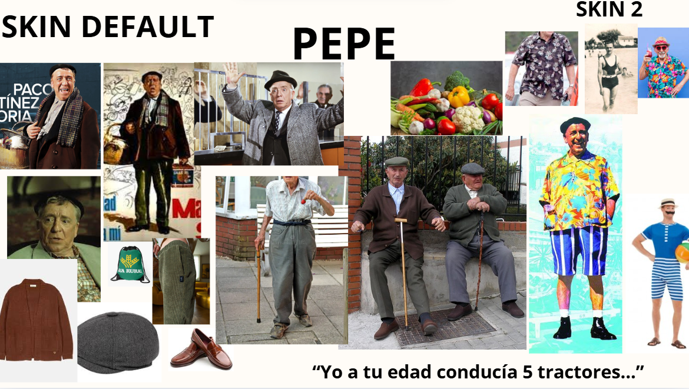
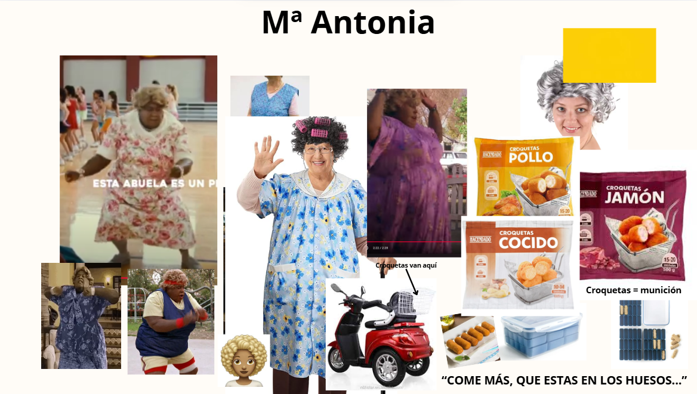
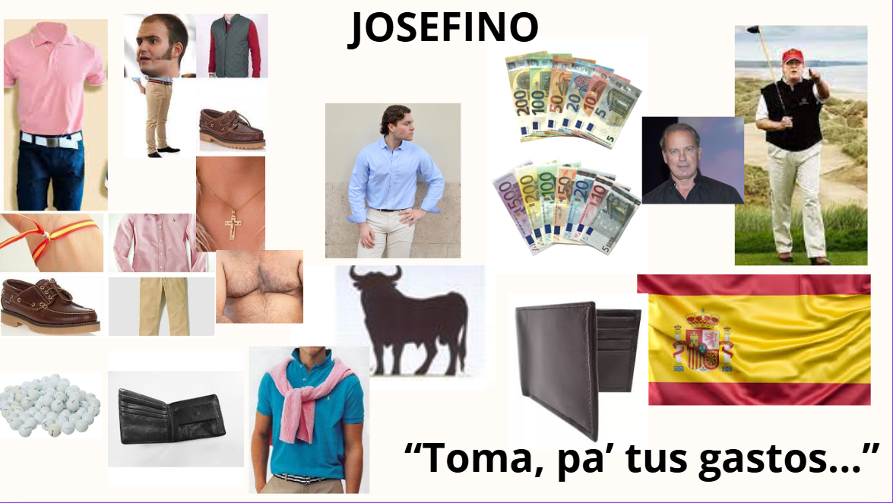
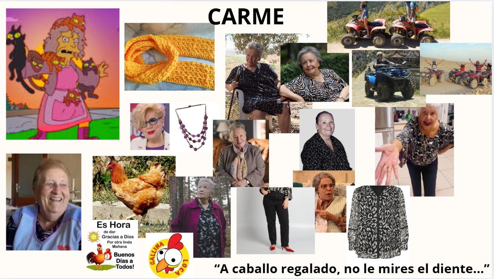
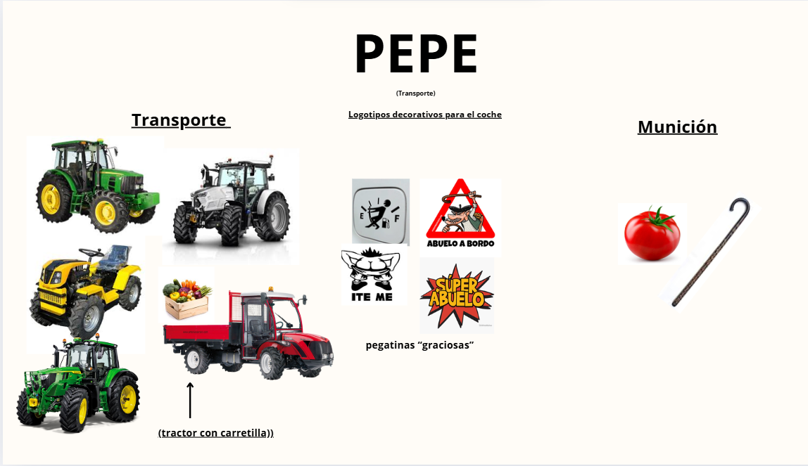
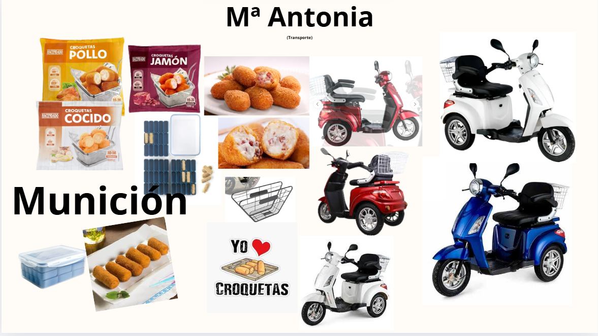
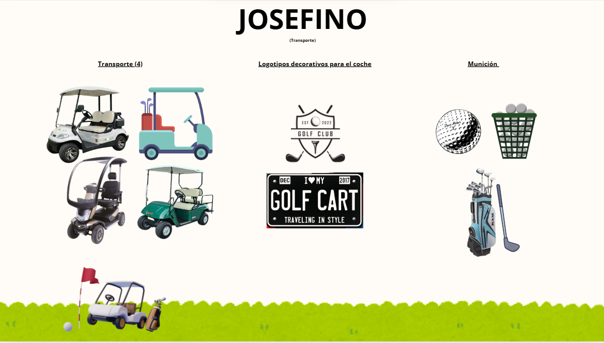
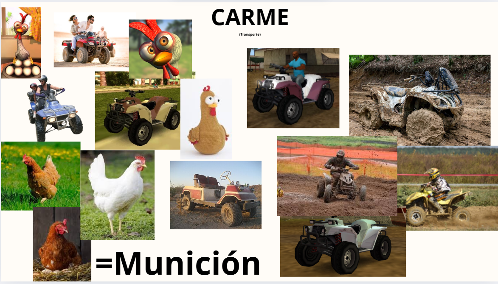

# CHARACTERS

There will be 4 characters each with 1 recolor both for vehicle and character.

The characters are grandparents and are as follows:

```Pepe:``` A typical Spanish grandpa from the village, beret, inspired by Paco Martinez Soria, drives a tractor and throws tomatoes.

```Maria Antonia:``` A housewife grandma, she wears clothes with floral prints, inspired by the grandma from the movie "Big Momma’s House", she drives a 3-wheeled motorcycle with a basket on the back throwing croquettes.

```Josefino:``` A rich grandpa, drives a golf cart and throws golf balls

```Carme:``` Village grandma wears black clothes with prints, inspired by the cat craze but throws chickens, drives a quad.

## ANIMATIONS
3 animations:

* Selection screen  
* Win  
* Lose

The characters will be modeled by separating the character model, the cart and the wheels

## MOODBOARDS








